# 07. 데이터 모델과 상세 ERD

## 1. 모델링 원칙

1. Markdown은 원본이다.
2. Node는 Page, Task, Event, Project, Attachment의 공통 식별자다.
3. Tag, Link, Task Index, Chunk, Embedding은 원문에서 재생성할 수 있다.
4. Page 변경은 Revision을 만든다.
5. AI 변경은 Proposal을 거쳐 Page Revision으로 반영된다.
6. Schema Migration은 순차 Version과 Checksum을 가진다.

## 2. 상세 ERD

```mermaid

erDiagram
    WORKSPACE ||--o{ NODE : contains
    OBJECT_TYPE ||--o{ NODE : classifies
    OBJECT_TYPE ||--o{ PROPERTY_DEFINITION : defines
    NODE ||--o| PAGE : page_detail
    NODE ||--o| PROJECT : project_detail
    NODE ||--o| TASK : task_detail
    NODE ||--o| EVENT : event_detail
    NODE ||--o| ATTACHMENT : attachment_detail
    PAGE ||--o{ PAGE_REVISION : keeps
    PAGE ||--o{ BLOCK_ANCHOR : contains
    NODE ||--o{ PROPERTY_VALUE : has
    PROPERTY_DEFINITION ||--o{ PROPERTY_VALUE : validates
    WORKSPACE ||--o{ TAG : owns
    NODE ||--o{ NODE_TAG : tagged_with
    TAG ||--o{ NODE_TAG : applies_to
    NODE ||--o{ NODE_RELATION : source_node
    NODE ||--o{ NODE_RELATION : target_node
    PROJECT ||--o{ TASK : groups
    TASK ||--o{ TASK_DEPENDENCY : task_side
    TASK ||--o{ TASK_DEPENDENCY : dependency_side
    RECURRENCE_RULE ||--o{ TASK : repeats
    RECURRENCE_RULE ||--o{ EVENT : repeats
    NODE ||--o{ OCCURRENCE : expands_to
    PAGE ||--o{ DOCUMENT_CHUNK : splits_into
    BLOCK_ANCHOR ||--o{ DOCUMENT_CHUNK : anchors
    DOCUMENT_CHUNK ||--o| CHUNK_EMBEDDING : vectorizes
    AI_MODEL ||--o{ CHUNK_EMBEDDING : creates
    WORKSPACE ||--o{ SAVED_VIEW : owns
    AI_BACKEND ||--o{ AI_MODEL : serves
    WORKSPACE ||--o{ AI_RUN : records
    AI_MODEL ||--o{ AI_RUN : executes
    AI_RUN ||--o{ AI_RUN_SOURCE : cites
    NODE ||--o{ AI_RUN_SOURCE : referenced_by
    AI_RUN ||--o{ AI_PROPOSAL : creates
    PAGE ||--o{ AI_PROPOSAL : targets
    AI_MODEL ||--o{ MODEL_BENCHMARK : measured_by
    WORKSPACE ||--o{ JOB : queues
    WORKSPACE ||--o{ SETTING : configures
    WORKSPACE ||--o{ BACKUP_RUN : backs_up
    WORKSPACE ||--o{ AUDIT_LOG : audits

    WORKSPACE {
        string id PK
        string name
        string storage_mode
        string data_path
        datetime created_at
        datetime updated_at
    }

    NODE {
        string id PK
        string workspace_id FK
        string object_type_id FK
        string node_kind
        string title
        string status
        int version
        string content_hash
        datetime created_at
        datetime updated_at
        datetime deleted_at
    }

    PAGE {
        string node_id PK
        string parent_node_id FK
        string body_markdown
        string icon
        string date_key
        boolean is_daily
        int sort_order
        string frontmatter_json
    }

    PAGE_REVISION {
        string id PK
        string page_id FK
        int revision_no
        string body_markdown
        string content_hash
        string reason
        datetime created_at
    }

    BLOCK_ANCHOR {
        string id PK
        string page_id FK
        string anchor_key
        string block_kind
        int source_start
        int source_end
        string text_hash
        string plain_text
        datetime updated_at
    }

    OBJECT_TYPE {
        string id PK
        string workspace_id FK
        string name
        string icon
        string base_kind
        string template_markdown
        boolean system_type
    }

    PROPERTY_DEFINITION {
        string id PK
        string object_type_id FK
        string property_key
        string label
        string data_type
        boolean required
        int sort_order
        string options_json
    }

    PROPERTY_VALUE {
        string id PK
        string node_id FK
        string definition_id FK
        string value_text
        float value_number
        boolean value_boolean
        string value_date
        string value_datetime
        string value_node_id FK
        string value_json
    }

    TAG {
        string id PK
        string workspace_id FK
        string name
        string normalized_name
        string color
    }

    NODE_TAG {
        string node_id PK
        string tag_id PK
        string source
        datetime created_at
    }

    NODE_RELATION {
        string id PK
        string source_node_id FK
        string target_node_id FK
        string relation_type
        string source_anchor_id FK
        datetime created_at
    }

    PROJECT {
        string node_id PK
        string project_status
        string start_date
        string due_date
        int priority
        float progress
    }

    TASK {
        string node_id PK
        string project_id FK
        string source_page_id FK
        string source_anchor_id FK
        string task_status
        int priority
        string start_at
        string due_at
        string completed_at
        int estimate_minutes
        string recurrence_rule_id FK
    }

    TASK_DEPENDENCY {
        string task_id PK
        string depends_on_task_id PK
        string dependency_type
    }

    EVENT {
        string node_id PK
        string source_page_id FK
        string start_at
        string end_at
        boolean all_day
        string timezone
        string location
        string recurrence_rule_id FK
    }

    RECURRENCE_RULE {
        string id PK
        string rrule
        string timezone
        string until_at
        int occurrence_count
    }

    OCCURRENCE {
        string id PK
        string source_node_id FK
        string occurrence_start
        string occurrence_end
        string state
        string override_json
    }

    ATTACHMENT {
        string node_id PK
        string page_id FK
        string filename
        string mime_type
        string relative_path
        int size_bytes
        string sha256
    }

    DOCUMENT_CHUNK {
        string id PK
        string page_id FK
        string anchor_id FK
        int chunk_no
        string heading_path
        string plain_text
        int token_count
        string content_hash
        string embedding_status
    }

    CHUNK_EMBEDDING {
        string chunk_id PK
        string model_id FK
        int dimensions
        blob vector_blob
        string quantization
        datetime updated_at
    }

    SAVED_VIEW {
        string id PK
        string workspace_id FK
        string name
        string target_kind
        string layout
        string query_json
        string sort_json
        string group_json
    }

    AI_BACKEND {
        string id PK
        string backend_kind
        string endpoint
        boolean enabled
        string capabilities_json
    }

    AI_MODEL {
        string id PK
        string backend_id FK
        string model_key
        string model_role
        string format
        string quantization
        string local_path
        string sha256
        int context_tokens
    }

    AI_RUN {
        string id PK
        string workspace_id FK
        string model_id FK
        string action_type
        string status
        string prompt_hash
        int prompt_tokens
        int generated_tokens
        int ttft_ms
        int total_ms
        float prefill_tps
        float decode_tps
        float mtp_acceptance_rate
        string error_code
        datetime started_at
        datetime ended_at
    }

    AI_RUN_SOURCE {
        string ai_run_id PK
        string node_id PK
        string anchor_id FK
        int source_rank
        float relevance_score
    }

    AI_PROPOSAL {
        string id PK
        string ai_run_id FK
        string page_id FK
        int base_revision
        string proposal_type
        string patch_text
        string status
        datetime reviewed_at
    }

    MODEL_BENCHMARK {
        string id PK
        string model_id FK
        string device_fingerprint
        string config_json
        int load_ms
        int ttft_ms
        float prefill_tps
        float decode_tps
        int peak_rss_mb
        datetime created_at
    }

    JOB {
        string id PK
        string workspace_id FK
        string job_type
        string entity_id
        string status
        int priority
        int attempts
        string available_at
        string last_error
    }

    SETTING {
        string workspace_id PK
        string setting_key PK
        string value_json
        datetime updated_at
    }

    BACKUP_RUN {
        string id PK
        string workspace_id FK
        string backup_path
        string sha256
        int size_bytes
        string status
        datetime created_at
    }

    AUDIT_LOG {
        string id PK
        string workspace_id FK
        string actor
        string action
        string target_node_id FK
        string detail_json
        datetime created_at
    }

```



원본: `diagrams/data-erd.mmd`

## 3. GA 필수 Table

### 3.1 `schema_migrations`

```sql
CREATE TABLE schema_migrations (
  version INTEGER PRIMARY KEY,
  name TEXT NOT NULL,
  checksum TEXT NOT NULL,
  applied_at TEXT NOT NULL
);
```

### 3.2 `workspaces`

현재 Single Workspace라도 Table을 둔다. 향후 여러 Workspace와 설정 Scope를 지원하되 GA UI는 하나만 노출할 수 있다.

### 3.3 `nodes`

공통 Metadata:

- ID
- Workspace
- Object Type
- Kind
- Title
- Status
- Version
- Content Hash
- Timestamps
- Soft Delete

Page만 조회할 때 불필요한 Attachment/Event Column을 가져오지 않게 Detail Table을 분리한다.

### 3.4 `pages`

```sql
CREATE TABLE pages (
  node_id TEXT PRIMARY KEY REFERENCES nodes(id) ON DELETE CASCADE,
  parent_node_id TEXT REFERENCES nodes(id),
  body_markdown TEXT NOT NULL,
  icon TEXT NOT NULL DEFAULT '📄',
  date_key TEXT,
  is_daily INTEGER NOT NULL DEFAULT 0,
  sort_order INTEGER NOT NULL DEFAULT 0,
  frontmatter_json TEXT NOT NULL DEFAULT '{}'
);
```

`parent_id`와 `project_parent_id`를 계속 두지 않는다.

- Tree Parent: `parent_node_id`
- Project 소속: `node_relations` 또는 `property_values`
- Daily 소속: `date_key`

### 3.5 `page_revisions`

```sql
CREATE TABLE page_revisions (
  id TEXT PRIMARY KEY,
  page_id TEXT NOT NULL REFERENCES pages(node_id) ON DELETE CASCADE,
  revision_no INTEGER NOT NULL,
  title TEXT NOT NULL,
  body_markdown TEXT NOT NULL,
  content_hash TEXT NOT NULL,
  reason TEXT NOT NULL,
  created_at TEXT NOT NULL,
  UNIQUE(page_id, revision_no)
);
```

### 3.6 `block_anchors`

Markdown AST에서 Heading, Task, List, Paragraph의 Stable Anchor를 만든다.

Anchor 생성 우선순위:

1. 기존 Hidden Marker
2. Heading Slug+Occurrence
3. Task Marker
4. Text Hash+주변 문맥
5. Source Offset

Offset만 사용하면 문서 앞부분 수정 때 위치가 밀린다.

### 3.7 `tags`, `node_tags`

`pages.tags` JSON은 Migration 이후 Read Compatibility 기간만 유지한다.

```sql
CREATE UNIQUE INDEX ux_tags_workspace_normalized
ON tags(workspace_id, normalized_name);
```

### 3.8 `node_relations`

Relation Type 예:

- `parent`
- `project`
- `mentions`
- `decided_in`
- `assigned_to`
- `supplier_of`
- `item_of`
- `related`

### 3.9 `tasks`

Task는 Node Detail이다. Markdown Checkbox에서 파생되지만 Due/Status 등의 구조화 변경을 원문에 되돌려야 한다.

필수 필드:

- `source_page_id`
- `source_anchor_id`
- `task_status`
- `priority`
- `start_at`
- `due_at`
- `completed_at`
- `project_id`
- `recurrence_rule_id`

### 3.10 `events`

수동 Event는 원본이고, Page Date나 Task Due에서 파생된 Calendar Item은 별도 View Query로 계산할 수 있다.

### 3.11 `document_chunks`

Chunk는 Markdown Heading 경계를 우선한다.

권장:

- 300~700 Token
- 50~100 Token Overlap
- Heading Path 저장
- Content Hash 저장
- Page Revision 변경 시 영향 Chunk만 재생성

### 3.12 `ai_runs`, `ai_run_sources`, `ai_proposals`

AI Run과 원문 변경을 분리한다.

- AI Run: 실행과 지표
- AI Source: 근거
- AI Proposal: 사용자 승인 전 변경안
- Page Revision: 승인된 최종 변경

## 4. FTS

```sql
CREATE VIRTUAL TABLE page_fts USING fts5(
  node_id UNINDEXED,
  title,
  body,
  tags,
  properties,
  headings,
  tokenize = 'unicode61'
);
```

한국어 1~2글자 검색은 `unicode61`만으로 충분하지 않을 수 있다.

GA 권장:

1. 3글자 이상: FTS BM25
2. 1~2글자: 제목/Tag Prefix+LIKE 제한 검색
3. 필요 시 2.1에서 n-gram Auxiliary Table

검색 결과는 Page 전체 본문이 아니라 Snippet과 Score를 반환한다.

```ts
interface SearchHit {
  nodeId: string;
  nodeKind: string;
  title: string;
  snippet: string;
  matchField: string;
  score: number;
  anchorId?: string;
}
```

## 5. Index

```sql
CREATE INDEX ix_nodes_workspace_updated
ON nodes(workspace_id, updated_at DESC);

CREATE INDEX ix_pages_parent_sort
ON pages(parent_node_id, sort_order);

CREATE INDEX ix_pages_date
ON pages(date_key, sort_order);

CREATE INDEX ix_node_relations_source_type
ON node_relations(source_node_id, relation_type);

CREATE INDEX ix_node_relations_target_type
ON node_relations(target_node_id, relation_type);

CREATE INDEX ix_tasks_status_due
ON tasks(task_status, due_at);

CREATE INDEX ix_events_start_end
ON events(start_at, end_at);

CREATE INDEX ix_chunks_page_no
ON document_chunks(page_id, chunk_no);

CREATE INDEX ix_jobs_status_available
ON jobs(status, available_at, priority);
```

## 6. Save Transaction

```sql
BEGIN IMMEDIATE;

SELECT version
FROM nodes
WHERE id = :page_id;

-- base_version mismatch면 ROLLBACK

UPDATE nodes
SET title = :title,
    version = version + 1,
    content_hash = :hash,
    updated_at = :updated_at
WHERE id = :page_id;

UPDATE pages
SET body_markdown = :markdown,
    frontmatter_json = :frontmatter
WHERE node_id = :page_id;

INSERT INTO page_revisions (...);

INSERT INTO jobs (
  id, workspace_id, job_type, entity_id,
  status, priority, attempts, available_at
) VALUES (
  :job_id, :workspace_id, 'reindex_page', :page_id,
  'pending', 100, 0, :updated_at
);

COMMIT;
```

Index Job 실패는 Revision 저장을 취소하지 않는다.

## 7. Task Marker

```markdown
- [ ] 업체 미팅 자료 준비 @due(2026-08-20) @p1
  <!-- memoji-task:01J6FJ6VY1JK5CSG51D8QKQ9P3 -->
```

Marker는 Export에 포함되지만 Renderer에서 숨긴다.

## 8. Migration V2→V3

### Step 1

- 현재 DB `quick_check`
- Backup
- Schema V3 생성

### Step 2

기존 Page별:

1. Node INSERT
2. Page INSERT
3. Initial Revision INSERT
4. Tag JSON Parse
5. Markdown Tag Parse
6. Wiki Link Parse
7. Task Parse
8. Index Job

### Step 3

Parent 처리:

- `project_parent_id ?? parent_id`를 임시 Parent로 사용
- Cycle 검증
- Project Root를 Object Type `project`로 표시할 수 있으나 자동 추정은 보수적으로 한다.
- Parent가 없는 Project Page는 Root Tree에 둔다.

### Step 4

검증:

- Page Count
- Folder Count
- Content Hash
- Parent Count
- Tag Count
- Unresolved Link Count
- Task Count
- Orphan Count
- Cycle Count

### Step 5

Migration 성공 후에도 기존 Column은 한 Release 동안 Read Compatibility를 유지할 수 있다. 새 Write는 V3에만 한다.

## 9. Backup

Backup Manifest:

```json
{
  "formatVersion": 2,
  "appVersion": "2.0.0",
  "schemaVersion": 3,
  "createdAt": "2026-08-14T16:00:00+09:00",
  "database": {
    "path": "memoji.db",
    "sha256": "...",
    "sizeBytes": 123456
  },
  "counts": {
    "pages": 120,
    "revisions": 840,
    "tags": 42,
    "tasks": 91,
    "events": 12,
    "attachments": 0
  }
}
```

## 10. Embedding

Embedding은 GA Blocker가 아니다. FTS와 Link/Property RAG를 먼저 구현한다.

Embedding 추가 조건:

- FTS 정확도 Benchmark가 부족함
- VDI에서 Embedding Model 메모리 예산 확보
- Vector Storage/License 검토
- 재색인 시간 허용

SQLite BLOB 저장을 기본으로 하고 별도 Vector DB는 도입하지 않는다.
