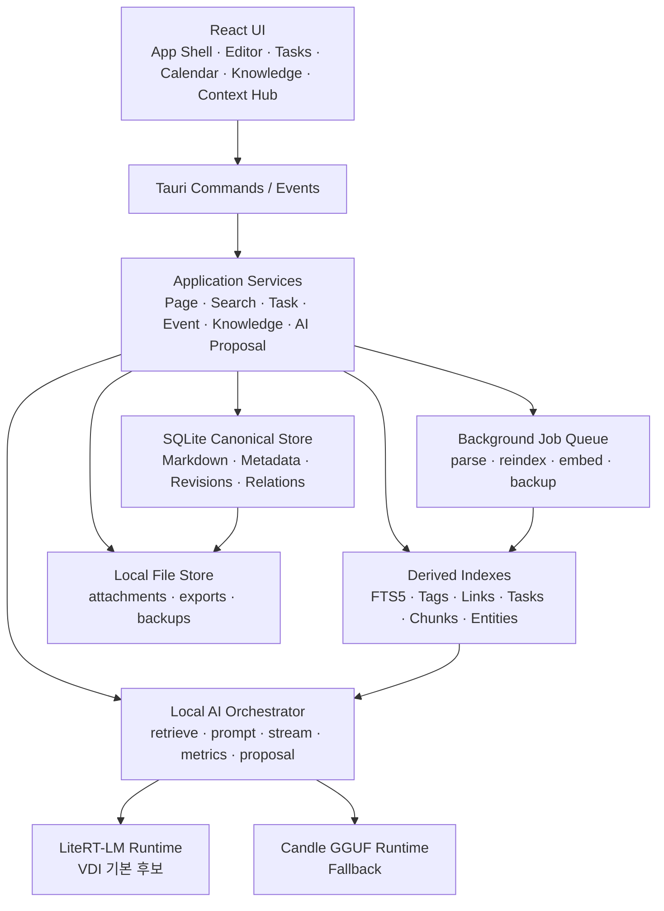

# 08. 시스템 구성안

## 1. 전체 구조



## 2. Layer

### 2.1 Presentation

- React
- Milkdown
- Radix
- cmdk
- react-resizable-panels
- Tauri Event Stream

Presentation은 SQL과 File Path 정책을 알지 않는다.

### 2.2 Application Service

```text
PageService
NavigationService
SearchService
TaskService
CalendarService
KnowledgeService
AiOrchestrator
ProposalService
BackupService
MigrationService
DiagnosticService
```

Application Service가 Transaction 경계와 권한을 관리한다.

### 2.3 Repository

```text
NodeRepository
PageRepository
RevisionRepository
TagRepository
LinkRepository
TaskRepository
EventRepository
ChunkRepository
AiRunRepository
ProposalRepository
SettingsRepository
JobRepository
```

### 2.4 Infrastructure

- SQLite/Rusqlite
- Local File Store
- LiteRT Process Manager
- Candle Runtime
- Logging
- Hashing
- ZIP
- OS Window/File Dialog

## 3. Tauri Command

### Page

```text
list_page_summaries
get_page_body
save_page_v2
move_page_v2
trash_page
restore_page
list_page_revisions
restore_page_revision
```

### Search

```text
search_workspace
search_commands_context
reindex_page
reindex_workspace
get_index_status
```

### Context

```text
get_page_outline
get_page_links
get_page_tasks
get_page_properties
```

### Task/Event

```text
list_tasks
update_task
list_events
save_event
delete_event
import_ics
export_ics
```

### AI

```text
local_ai_status_v2
local_ai_load_profile
local_ai_generate_v2
local_ai_cancel
local_ai_benchmark_v2
create_ai_proposal
get_ai_proposal
apply_ai_proposal
reject_ai_proposal
```

### Data

```text
get_storage_status
backup_database
import_database_path
export_workspace_zip
run_migration
export_diagnostic_bundle
```

## 4. Event

```text
memoji://page-saved
memoji://page-conflict
memoji://page-indexed
memoji://index-failed
memoji://ai-status
memoji://ai-stream
memoji://ai-completed
memoji://ai-canceled
memoji://runtime-started
memoji://runtime-stopped
memoji://runtime-failed
memoji://migration-progress
```

Event Payload는 `eventVersion`을 포함한다.

```rust
#[derive(Serialize)]
#[serde(rename_all = "camelCase")]
struct VersionedEvent<T> {
    event_version: u32,
    payload: T,
}
```

## 5. Background Job Queue

SQLite 기반 Job Queue로 충분하다.

Job Type:

- `reindex_page`
- `reindex_workspace`
- `extract_attachment`
- `build_embedding`
- `backup_database`
- `cleanup_revisions`
- `verify_runtime_manifest`

Worker 규칙:

1. App 시작 후 Pending Job 조회
2. `BEGIN IMMEDIATE`로 Claim
3. Running 상태와 Started At 기록
4. 성공/실패 기록
5. Exponential Backoff
6. 최대 Attempts
7. Markdown Save와 Worker 실패 분리

## 6. Index Pipeline

```text
Page Saved
  ↓
Job Pending
  ↓
Markdown Parse
  ├─ Frontmatter
  ├─ Heading Anchor
  ├─ Tag
  ├─ Wiki Link
  ├─ Task
  ├─ Mention
  └─ Chunk
  ↓
Transaction Replace Derived Index
  ↓
FTS Update
  ↓
page-indexed Event
```

Parser는 Frontend Milkdown DOM을 읽지 않는다. Rust 또는 공유 가능한 Markdown Parser가 Source Markdown을 읽는다.

## 7. AI Retrieval Pipeline

GA 1단계:

1. Current Page
2. Linked Page
3. Same Project
4. FTS Search
5. Recent Page

Scoring:

```text
finalScore =
  0.45 * bm25Normalized +
  0.20 * sameProject +
  0.15 * explicitLink +
  0.10 * recency +
  0.10 * objectTypeMatch
```

Semantic Embedding은 2.2에서 Optional Reranker로 추가한다.

## 8. Prompt Builder

Prompt Section을 명시적으로 관리한다.

```text
System
Task Instruction
Output Schema
Current Selection
Current Page Summary
Retrieved Sources
User Request
Generation Prefix
```

Context가 넘치면 다음 순서로 줄인다.

1. 낮은 Score Source 제거
2. Source Chunk 길이 축소
3. Current Page의 관련 Heading만 유지
4. Conversation History 요약
5. System/Output Schema는 유지

Token 배열 뒤를 단순 절단하지 않는다.

## 9. Runtime Adapter

```rust
#[async_trait]
pub trait InferenceRuntime: Send + Sync {
    fn capabilities(&self) -> RuntimeCapabilities;
    async fn health(&self) -> Result<RuntimeHealth, RuntimeError>;
    async fn load(&self, profile: &ModelProfile) -> Result<(), RuntimeError>;
    async fn generate_stream(
        &self,
        request: GenerateRequest,
        cancel: CancellationToken,
        sink: StreamSink,
    ) -> Result<GenerateMetrics, RuntimeError>;
    async fn benchmark(
        &self,
        plan: BenchmarkPlan,
    ) -> Result<BenchmarkReport, RuntimeError>;
    async fn shutdown(&self) -> Result<(), RuntimeError>;
}
```

Runtime:

- `LiteRtRuntime`
- `CandleRuntime`
- `OpenAiCompatibleLoopbackRuntime`

`OpenAiCompatibleLoopbackRuntime`를 MTP Runtime이라고 명명하지 않는다.

## 10. Runtime Process Manager

Managed Runtime State:

```rust
enum ManagedRuntimeState {
    NotBundled,
    Stopped,
    Starting,
    Ready,
    Degraded,
    Failed,
}
```

Health는 다음을 분리한다.

1. Process Alive
2. Port Open
3. HTTP Ready
4. Model Registered
5. Test Generation
6. Capability

고정 Port 9379가 충돌하면:

- Process Instance Marker 확인
- Memoji Process가 아니면 다른 Port 선택
- 선택 Port와 Auth Token을 Settings에 Runtime Session 동안 저장
- 무인증 포트를 그대로 재사용하지 않음

## 11. 저장소 위치

```text
DataRoot/
├── memoji.db
├── backups/
├── exports/
├── attachments/
├── diagnostics/
├── logs/
└── runtime/
    ├── cache/
    └── session/
```

Model/Runtime Bundle은 App Directory 또는 관리자 배포 경로에 둘 수 있다. 사용자 DB와 Runtime Cache를 같은 정책으로 보지 않는다.

## 12. 오류 모델

```rust
enum AppErrorCode {
    StorageNotWritable,
    DatabaseCorrupt,
    MigrationFailed,
    RevisionConflict,
    SearchIndexUnavailable,
    RuntimeNotBundled,
    RuntimeStartFailed,
    RuntimeUnreachable,
    RuntimeModelMissing,
    GenerationCanceled,
    GenerationFailed,
    ProposalConflict,
}
```

UI는 Error String을 Parsing하지 않고 Code를 기준으로 안내한다.

## 13. 배포 Profile

### Core

- App
- SQLite
- Editor
- Search
- Task/Calendar
- AI Client
- Model 미포함

### VDI AI Bundle

- Core
- LiteRT-LM Runtime
- Gemma 4 E2B Model
- Tokenizer/Config
- SHA256 Manifest
- NOTICE

### VDI Fallback

- Core
- Candle GGUF
- 작은 Context
- 느리지만 Server 없이 작동

## 14. Trust Boundary

```text
User Input
  ↓
React UI
  ↓ IPC Boundary
Tauri Command Validation
  ↓
Application Service
  ├─ SQLite
  ├─ Local File Store
  └─ Loopback Runtime with Token
```

다음은 신뢰하지 않는다.

- UI가 넘긴 File Path
- Imported DB
- Runtime Error Body
- Model Manifest
- AI Response
- Markdown Link Target
- Attachment Filename

모두 Validation과 길이 제한을 적용한다.
